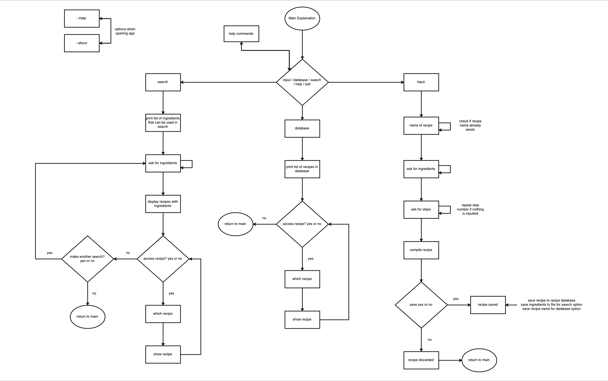
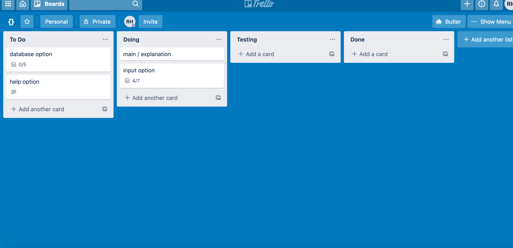
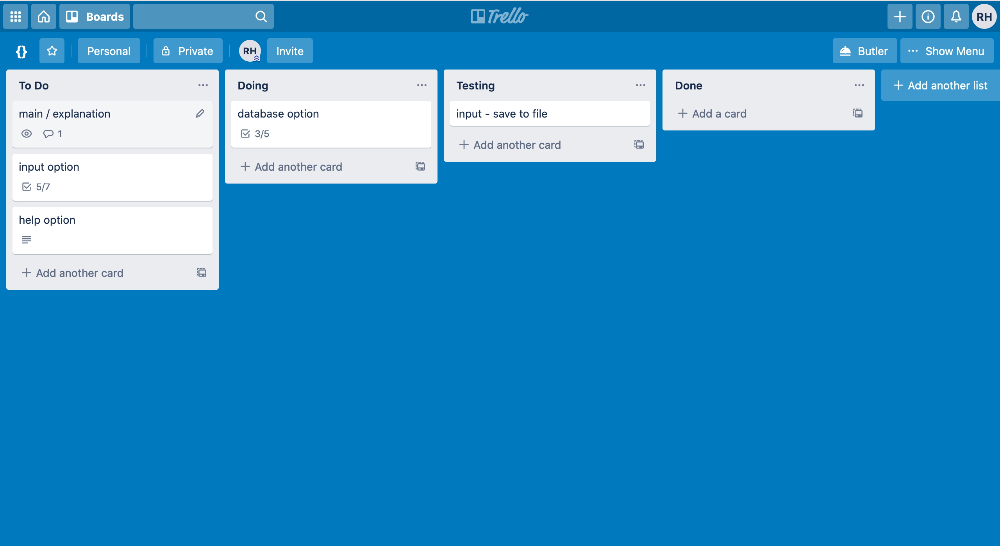
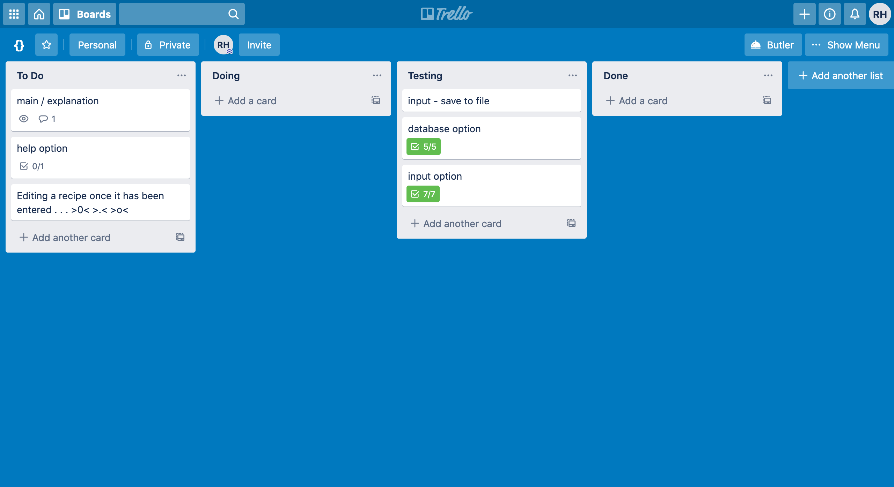
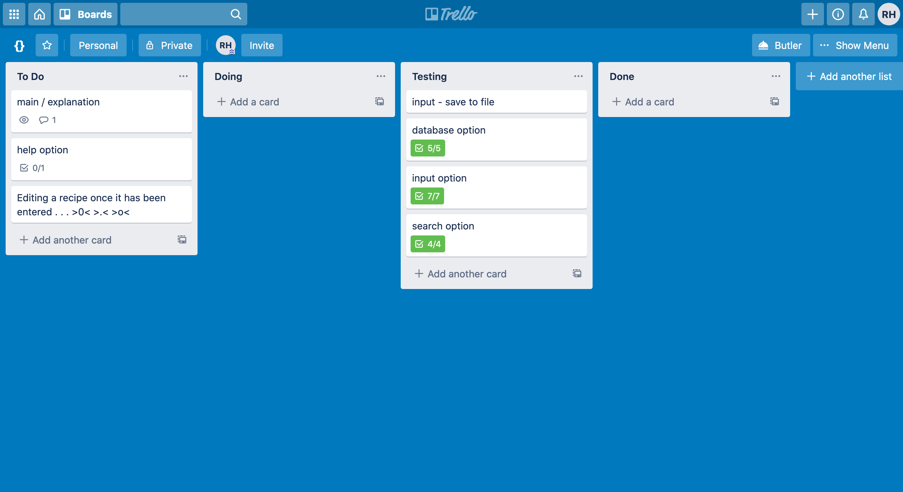
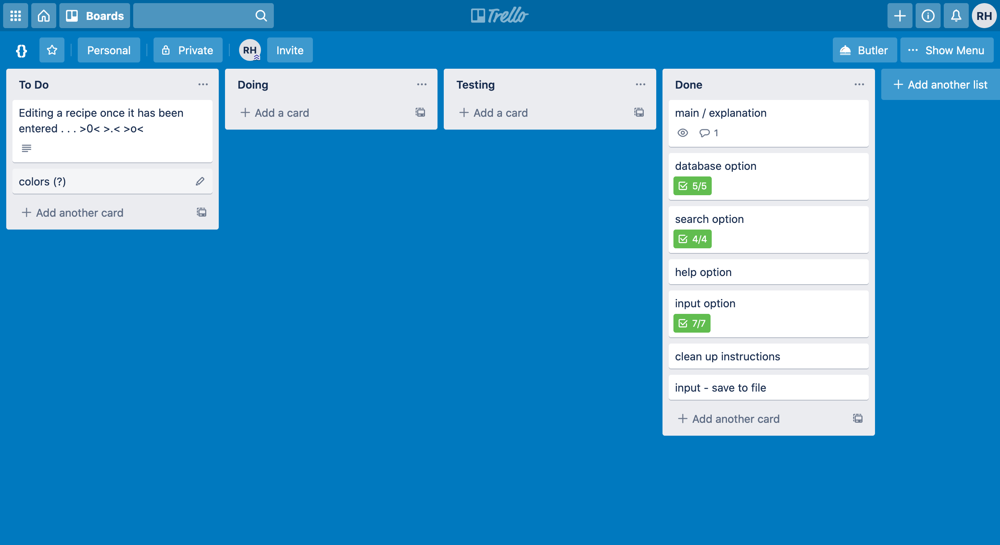
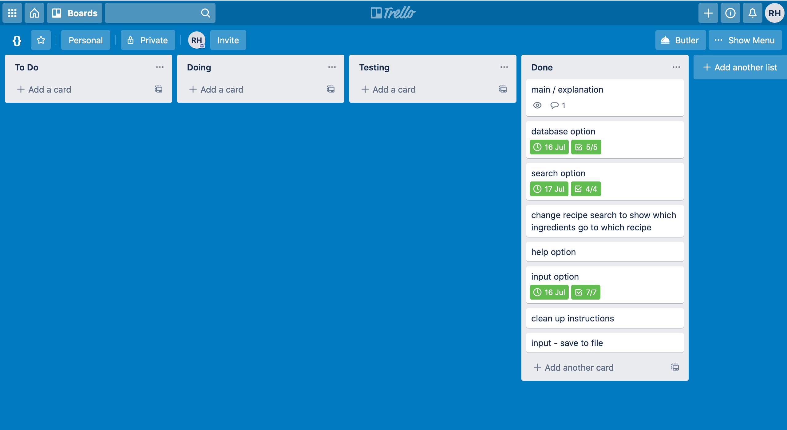

# Software Development Plan

## Statement of Purpose and Scope

Zitrone is an application that will provide a simple and easy way to access and store recipes. Zitrone will have three main functions: inputting and storing new recipes, view a database of stored recipes, and searching recipes by ingredient.
  1. The recipe input feature will enable the user to easily input a recipe for storage. Rather than having recipes scattered here and there, Zitrone will allow the user to store their recipes in one central location.
  2. The database feature allows users to view all of their stored recipes in an alphabetically ordered list. This feature will make it easy for the user to scroll through their recipes if they aren't entirely sure what they want to make.
  3. Being able to search for a recipe by the ingredients will allow the user to make a meal using as many on hand ingredients as possible. The user will be able to type in what they already have in their kitchen and Zitrone will return a list of recipes that use those ingredients. The returned list will be ordered so that the recipe with the most ingredients that are in the users kitchen are outputted first.
  This is undoubtedly a very important feature as it will enable the user to perform a search using ingredients they have on hand leading to a reduction in waste from ingredients going bad. This feature will also show the recipes that use the highest amount of ingredients first, so that waste is further reduced.

Zitrone will be targeted towards anyone who cooks.
Young adults starting out on their own who need a manageable and convenient place to store their recipes. As the program provides quick and easy access once their recipes are stored they can quickly look up a recipe and get cooking. Many young adults are on a tight budget and being able to use as many on hand ingredients as possible will allow them to save money.

## Features

1. Recipe Input
    - As stated above the recipe input allows users to input their personal recipes and store them in a database.
    - The user will be able to access the recipe input feature by typing 'input' into the main section of the program. This will then take the user to a recipe creation function that will ask for the recipe name and save it to a name variable. Once the name is inputted the user enter a while loop asking for the ingredient and then the amount of the ingredient which will be saved in a list(??). Once the user has entered all of the ingredients they will be able to type in '(??)' to start typing in the recipe steps. This will enter a new while loop that will continue to ask for steps until the user types '(??)'. Once the user types '(??)' the recipe they typed in will be displayed and they will have the option to save.
2. Recipe Database
    - The recipe database will be accessed using the 'database' keyword in the main section of the program.
    - The database will be a simple for loop that will loop through all of the recipe names stored in a dictionary and print them to the screen in alphabetical order. The user will then have the option of typing in the name of one of the recipes to access it, or typing '(??)' to return to the main portion of the application. If the user has decided to access a recipe they will be able to return to the list of recipes using '(??)' or to the main portion of the program with '(??)'.

3. Search By Ingredient   
    - The user will be able to access the search by ingredient function by typing 'search' into the main portion of the program.
    - The search will then enter a while loop that asks for ingredients and stores them to a list until the user types '(??)'. The program will then loop through a dictionary that has ingredients as keys and a list of recipes that have those ingredients. It will create a new list with all of the recipes and then a new loop will go through list with all recipes and create a dictionary that counts how many times each recipe was in the list. The program will then return the recipes to the user in order of most ingredients to least ingredients.

4. Receive Help
    - There is undoubtedly a lot of information to absorb when learning to use a new application. The user will be able to type in 'help' at any time to open a help menu.
    - The help menu will go through the commands that they can use as well as an overview of how to use the application.

## User Interaction and Experience

The user will be greeted on the opening of the application with a few simple instructions and an explanation of how to find more using the 'help' option.
The user will interact with the program through the keyboard, somewhat like a text-based computer game. They will be able to type in commands and the program will direct them to the proper function.
Errors will be raised in try except blocks and will inform the user that something is wrong, or the entered material needs to be changed.  

## Control Flow Diagram

## Implementation Plan

Prioritisation:
1. input - I chose to implement my input feature first, as without this function the rest are essentially useless.
2. database - the database function would still allow the user to view their recipes and look through them for ingredients even if there was no search function. In addition, I thought I might be able to use some of the code from the database function in the search function.
3. search - I viewed this more as an extra feature if there was time as it was not a vital part in inputting or viewing recipes.

**Trello**
11 July Trello

13 July Trello

14 July Trello

15 July Trello

16 July Trello

17 July Trello 

## Status Updates

- 13 July: After much research and many errors I was able to figure out how to save the recipes the user entered so they could view them the next time they opened the app! In order to achieve this miraculous feat I created a function to open a text document write the recipe the user had entered into the text document and close the text document. Now my friends came the real challenge. For low and behold I could not access the material in the text document if the user had the desire to read their recipe and create their scrumptious treat! However, with a tad more googling and many more attempts, this too was solved. When the user wished to read their recipe and typed it into the input I merely opened the desired recipe and used a for loop to read each line to the user. What a marvellous fix. Huzzah!

- 16 July: Today... Today my friend I have take cautionary measures. For unbeknownst to me there were measures to take, but thanks to a wise advisor it was spotted! The recipes saved to the database were being overwritten! Oh the horror! The poor fool who inputted two recipes with the same name would surely be overcome with sadness and woe. And yet. Thanks to this keen eyed advisor the err of my program was spotted and measures have been taken. Now, you may be asking what could be done to prevent this gross occurrence, and I shall tell you: directly under the input for the name of the recipe I added a sneaky little check. Yes! A check. This check would take the potential name of the file and check that the file did not already exist in the desired directory. ~Ingenious I know.~ If (a conditional to the rescue!) the path were to already exist, the program would merely inform the user and they would be given the opportunity to choose a new name for their lavish meal. This, my friend, is my cautionary tail. You can never be too careful, and keep a watchful eye ;)

- 17 July: Implemented viewing recipe from database option into search option. Now the user can search for recipes by ingredient and then view the recipe if they want to make it or get a closer look!

_Reflections:_
- _Realised I need to be a bit clearer with my variable names as they're all rather similar which can be a bit confusing at times._
- _In the future it would probably be best to make code comments from the beginning to help remember what different functions do at a glance. Doing so definitely would have sped up my coding process._
- _I found I didn't really like using the Trello board. It might have just been the way I set it up, but I tended towards my usual method of writing things down for each day. I did like that it provided the opportunity to think through and write down all of the steps that would need to be completed._
- _Testing... I really should have done it more as I was making my app. It became much harder to do it closer to the end after I had already fixed the majority of the bugs and not written any of it down._
- _My code felt a bit messy by the end. I felt like I was repeating things in some places and the code could have been cleaner. This may have been due to my variable names being so alike. For the next app I could write out mored pseudo code and have a clearer flow chart so I have a clearer picture of the overall outcome before I actually start coding._

## Installation Steps

_System Requirement_: You must have python3 installed on your computer for this app to work.

Once the application has been downloaded onto your computer:
1. open the terminal and navigate to the file with the application
2. type in `chmod +x main.py`
3. type `./main.py` to open the application

**Options:**
`./main.py --help`  view list of commands that can be used in app
`./main.py --about` a bit about the app
`./main.py --input` quickly input a recipe

**IMPORTANT**: Please do not touch the files within the applications folder. Changing these files may decrease functionality within the application.
