# Zitrone

Welcome to Zitrone! Your personal recipe database (with some cool functions).

There are three main functions you can perform with this application.
1. Input files into your personal database
2. Access a database of your files for viewing
3. Search for recipes by ingredients


## Installation Steps

_System Requirement_: You must have python3 installed on your computer for this app to work.

Make sure the latest version of python (python3) is installed on your machine:
```
$ python --version
```
If you do not have a version of python3 installed:
```
$ brew install python
```
Open terminal and navigate to the directory with the application and run:
```
$ chmod +x main.py
$ ./main.py
```

**Options:**
`./main.py --help`  view list of commands that can be used in app
`./main.py --about` a bit about the app

**IMPORTANT**: Please do not touch the files within the applications folder. Changing these files may decrease functionality within the application.


## Software Development Plan

### Statement of Purpose and Scope

Zitrone is an application that will provide a simple and easy way to access and store recipes. Zitrone will have three main functions: inputting and storing new recipes, view a database of stored recipes, and searching recipes by ingredient.
  1. The recipe input feature will enable the user to easily input a recipe for storage. Rather than having recipes scattered here and there, Zitrone will allow the user to store their recipes in one central location.
  2. The database feature allows users to view all of their stored recipes in an alphabetically ordered list. This feature will make it easy for the user to scroll through their recipes if they aren't entirely sure what they want to make.
  3. Being able to search for a recipe by the ingredients will allow the user to make a meal using as many on hand ingredients as possible. The user will be able to type in what they already have in their kitchen and Zitrone will return a list of recipes that use those ingredients. The returned list will be ordered so that the recipe with the most ingredients that are in the users kitchen are outputted first.
  This is undoubtedly a very important feature as it will enable the user to perform a search using ingredients they have on hand leading to a reduction in waste from ingredients going bad. This feature will also show the recipes that use the highest amount of ingredients first, so that waste is further reduced.

Zitrone will be targeted towards anyone who cooks.
Young adults starting out on their own who need a manageable and convenient place to store their recipes. As the program provides quick and easy access once their recipes are stored they can quickly look up a recipe and get cooking. Many young adults are on a tight budget and being able to use as many on hand ingredients as possible will allow them to save money.


### Features

1. Recipe Input
    - As stated above the recipe input allows users to input their personal recipes and store them in a database.
    - The user will be able to access the recipe input feature by typing 'input' into the main section of the program. This will then take the user to a recipe creation function that will ask for the recipe name and save it to a name variable. Once the name is inputted the user enter a while loop asking for the ingredient and then the amount of the ingredient which will be saved in a list(??). Once the user has entered all of the ingredients they will be able to type in '(??)' to start typing in the recipe steps. This will enter a new while loop that will continue to ask for steps until the user types '(??)'. Once the user types '(??)' the recipe they typed in will be displayed and they will have the option to save.
2. Recipe Database
    - The recipe database will be accessed using the 'database' keyword in the main section of the program.
    - The database will be a simple for loop that will loop through all of the recipe names stored in a dictionary and print them to the screen in alphabetical order. The user will then have the option of typing in the name of one of the recipes to access it, or typing '(??)' to return to the main portion of the application. If the user has decided to access a recipe they will be able to return to the list of recipes using '(??)' or to the main portion of the program with '(??)'.

3. Search By Ingredient   
    - The user will be able to access the search by ingredient function by typing 'search' into the main portion of the program.
    - The search will then enter a while loop that asks for ingredients and stores them to a list until the user types '(??)'. The program will then loop through a dictionary that has ingredients as keys and a list of recipes that have those ingredients. It will create a new list with all of the recipes and then a new loop will go through list with all recipes and create a dictionary that counts how many times each recipe was in the list. The program will then return the recipes to the user in order of most ingredients to least ingredients.

4. Receive Help
    - There is undoubtedly a lot of information to absorb when learning to use a new application. The user will be able to type in 'help' at any time to open a help menu.
    - The help menu will go through the commands that they can use as well as an overview of how to use the application.


### User Interaction and Experience

The user will be greeted on the opening of the application with a few simple instructions and an explanation of how to find more using the 'help' option.

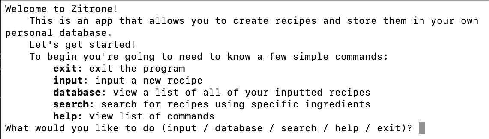

The user will interact with the program through the keyboard, somewhat like a text-based computer game. They will be able to type in commands and the program will direct them to the proper function.

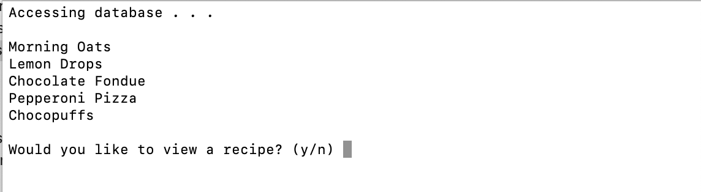  
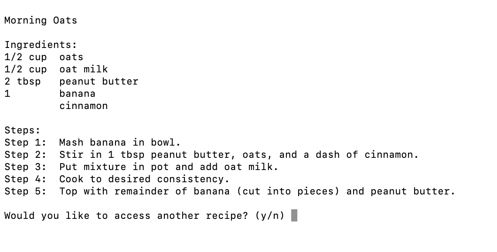  
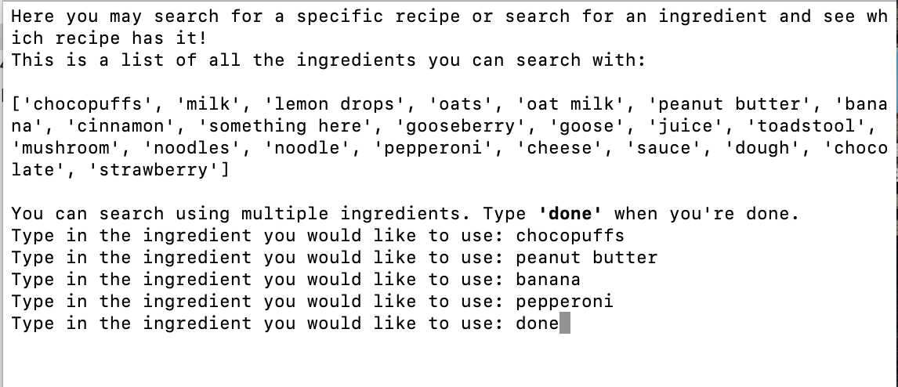  
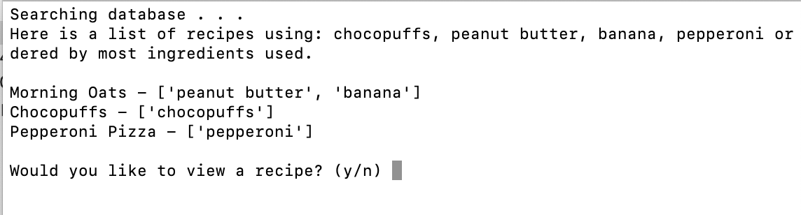  


### Control Flow Diagram

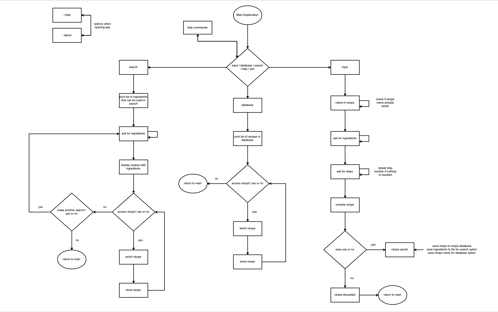


### Implementation Plan

Prioritisation:
1. input - I chose to implement my input feature first, as without this function the rest are essentially useless.
2. database - the database function would still allow the user to view their recipes and look through them for ingredients even if there was no search function. In addition, I thought I might be able to use some of the code from the database function in the search function.
3. search - I viewed this more as an extra feature if there was time as it was not a vital part in inputting or viewing recipes.

**Trello**

11 July Trello
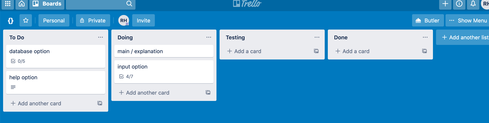
13 July Trello
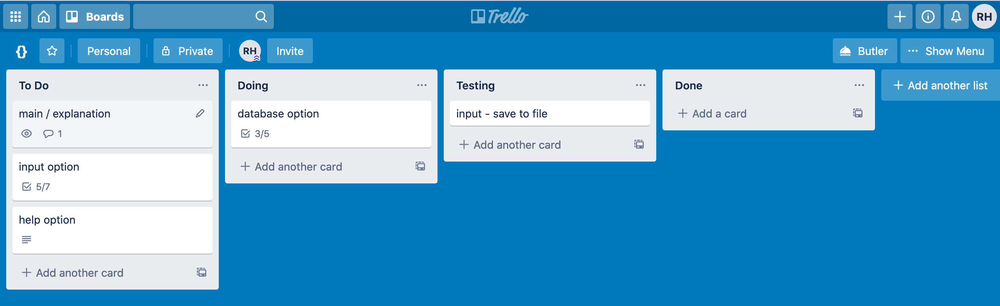
14 July Trello
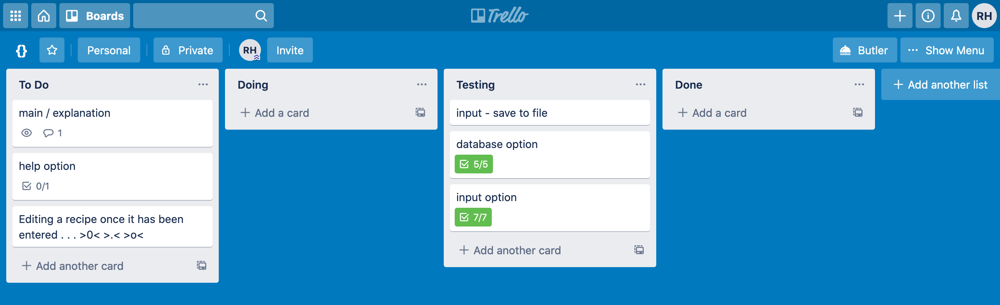
15 July Trello
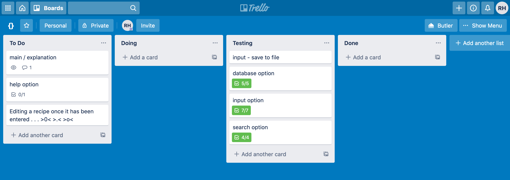
16 July Trello
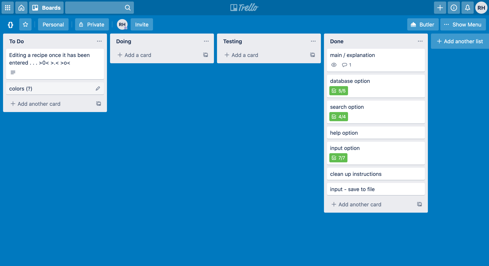
17 July Trello
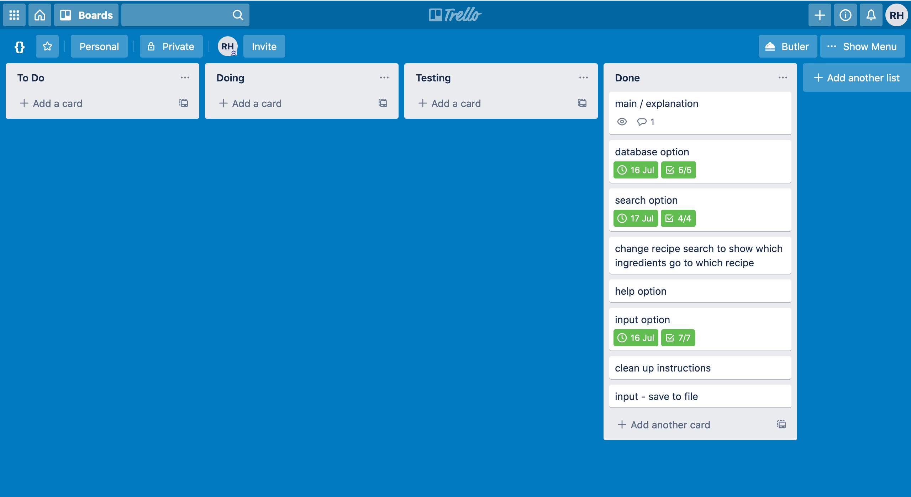


### Manual Testing

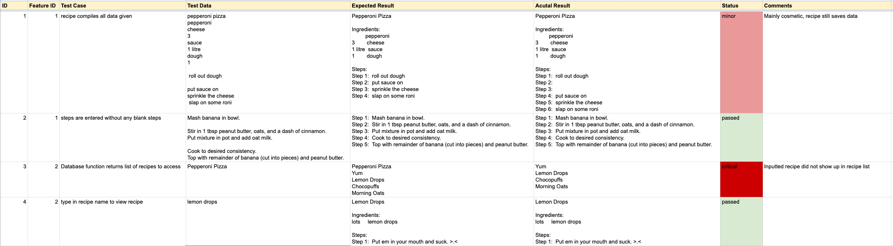

The majority of the testing was completed while making the application and was not recorded.
